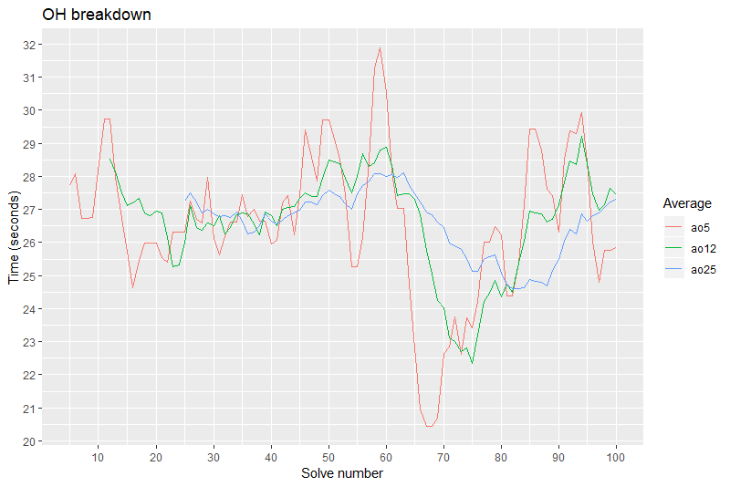

# qqstats

## What is this?

The initial commit for an R project for visualising and analysing qqtimer.net sessions. It will contain:

- Some analysis functions in a directory called `functions`.
- An `example` directory containing some sample data.
- A single R script called `calculate.R`, which should be run as follows in full in RStudio for the best results.

## What does it do?

- Calculate the Ao5, Ao12 and Ao25 moving averages for you.
- Calculate the seconds in which your solves fall. For example, 24.14s is a 24.
- Saves the data for you in your chosen directory.
- Visualise the data. Example below:



## How to use it

After cloning the project:

1. Open the project file in RStudio.
2. If necessary, install the necessary libraries:

```r
install.packages(c("lubridate", "ggplot2", "scales", "reshape2"))
```

3. Set your inputs - the name of the event and the directory for your results to be saved (and if you want them saved.)
4. Select the while script and run everything in one go.

## Enjoy!

If you liked the script, buy me a tea with some [XLM](https://www.stellar.org/):

GDGR5JMOB74XEYVKTBNZWJRNE4AGEMEHDIPEV2CI62P34VP33EQ3X7BJ